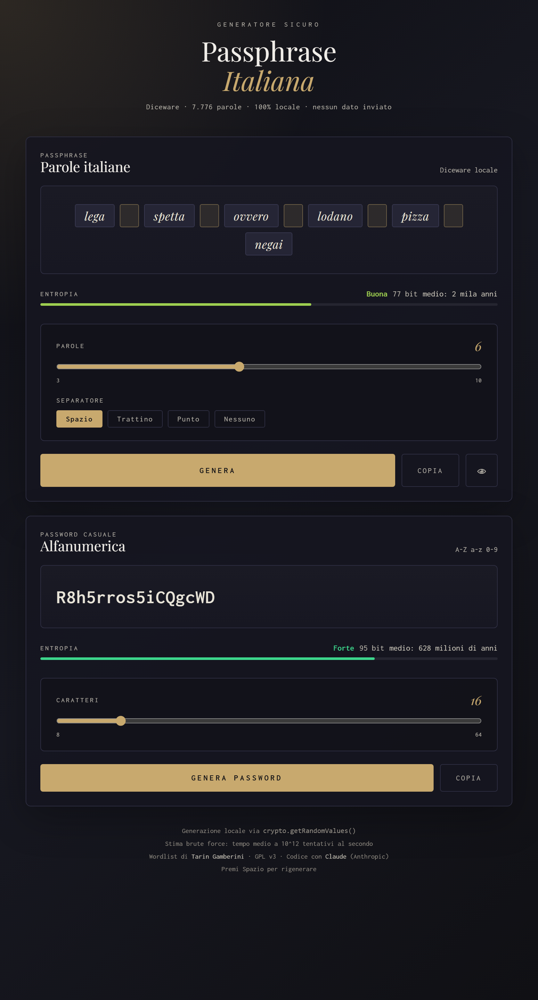

# Generatore Passphrase Italiana

Generatore di **passphrase in italiano** (metodo [Diceware](https://en.wikipedia.org/wiki/Diceware)) e di **password casuali alfanumeriche**, in una singola pagina HTML. Tutto avviene **localmente nel browser**: nessun dato viene inviato in rete.



## Caratteristiche

- 🎲 **Passphrase Diceware** da una wordlist italiana di **7.776 parole** (6⁵, lo standard Diceware).
- 🔐 **Password casuale alfanumerica** (A–Z, a–z, 0–9) da 8 a 64 caratteri.
- 🎯 **Casualità crittografica** con `crypto.getRandomValues()` e *rejection sampling* per evitare il bias del modulo.
- 📊 **Stima dell'entropia** in bit, con etichetta di robustezza e tempo medio di brute-force (a 10¹² tentativi/secondo).
- ⚙️ Numero di parole regolabile (3–10) e separatore selezionabile (spazio, trattino, punto, nessuno).
- 👁️ Mostra/nascondi la passphrase, copia negli appunti con un click.
- ⌨️ Premi **Spazio** per rigenerare al volo.
- 🚫 **100% offline**: nessun tracciamento, nessuna chiamata a server, nessuna dipendenza (a parte i Google Fonts, opzionali).

## Utilizzo

Non serve installare nulla. Apri semplicemente il file nel browser:

```
passphrase-italiana.html
```

Oppure, per una demo online, puoi pubblicare il file con **GitHub Pages** (Settings → Pages → branch `main`).

## Come funziona la sicurezza

Ogni parola della passphrase viene scelta uniformemente tra 7.776 voci, quindi ogni parola aggiunge `log₂(7.776) ≈ 12,9 bit` di entropia. Una passphrase di 6 parole vale circa **77 bit**, ampiamente sufficiente per un uso personale robusto.

La selezione degli indici casuali usa `crypto.getRandomValues()` con scarto dei valori fuori range (*rejection sampling*), così la distribuzione resta perfettamente uniforme e non introduce il bias tipico dell'operazione modulo.

## Struttura del progetto

```
.
├── passphrase-italiana.html   # L'applicazione completa (HTML + CSS + JS)
├── docs/
│   └── screenshot.png         # Screenshot per il README
├── LICENSE                    # GNU GPL v3
└── README.md
```

## Crediti e licenza

- **Wordlist italiana**: [Tarin Gamberini](https://www.taringamberini.com) — rilasciata sotto **GNU GPL v3**.
- **Codice**: scritto con l'assistenza di [Claude](https://claude.ai) (Anthropic).

Poiché il progetto incorpora e ridistribuisce la wordlist GPL v3, l'intero progetto è distribuito sotto la stessa licenza: **[GNU General Public License v3.0](LICENSE)**.
